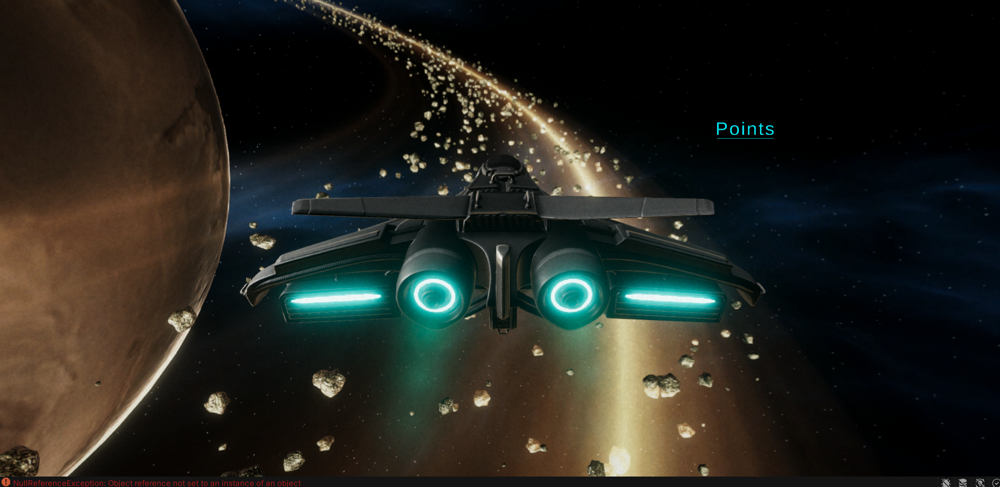
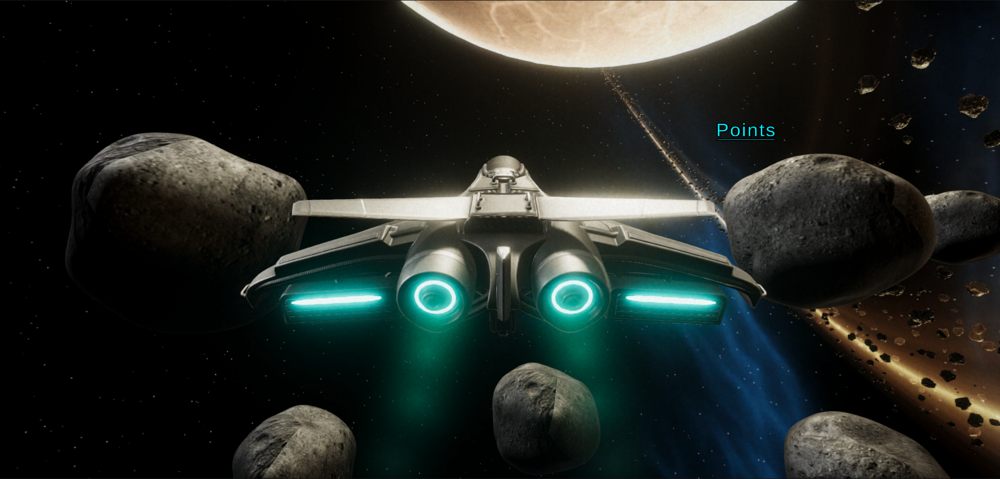
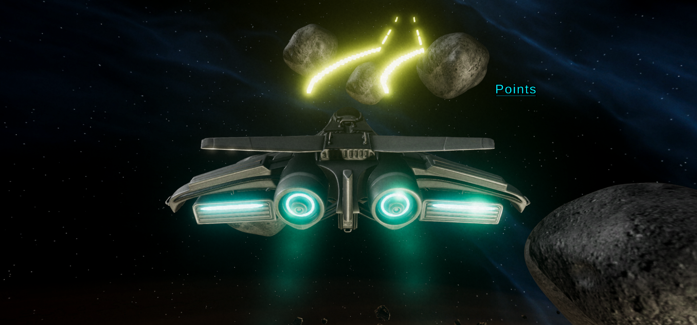

# Unity3D Space Shooter demo

Updated game project from our event [Making Games in Unity3D](https://gdsc.community.dev/events/details/developer-student-clubs-university-of-technology-presents-making-games-in-unity3d/)

**Unity Editor version:** 2020.3.33f1 LTS

### Screenshots

---

### Useful Links

**FREE 3D models & animations** :
https://www.mixamo.com/#/?page=1&type=Character

**Asset Store** :
https://assetstore.unity.com/

**FREE Unity assets mega list**
https://www.procedural-worlds.com/blog/best-free-unity-assets-categorised-mega-list/

**Recommended YouTube channels:**
- Game Maker's Toolkit
- Brackeys
- Dani
- Thomas Brush

## TODO:
- Make asteroids react to bullets
- Add points system
- Add sound FX and music